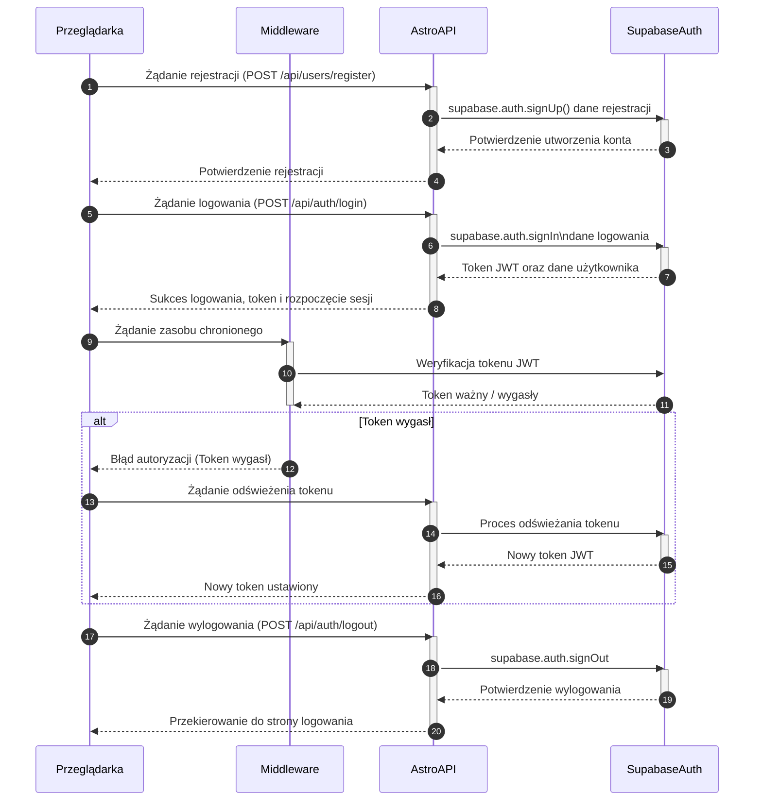

/* <authentication_analysis>
1. Przepływy autentykacji: Rejestracja, Logowanie, Wylogowanie, (opcjonalnie: Odzyskiwanie hasła).
2. Główni aktorzy: Przeglądarka (użytkownik korzysta z interfejsu), Middleware (weryfikje sesje),
   AstroAPI (obsługuje żądania) oraz SupabaseAuth (zarządza autoryzacją i sesjami).
3. Proces weryfikacji tokenu: Po logowaniu, API otrzymuje token JWT, który jest przechowywany w ciasteczkach.
   Middleware sprawdza token przy każdym żądaniu do zasobów chronionych. W przypadku wygasnięcia tokenu,
   może być uruchomiony proces odświeżania tokenu.
4. Proces rejestracji: Przeglądarka wysyła dane do rejestracji, AstroAPI wywołuje supabase.auth.signUp,
   a następnie informuje użytkownika o pomyślnej rejestracji.
5. Proces logowania: Przeglądarka wysyła dane do logowania, AstroAPI używa supabase.auth.signIn,
   która zwraca token, a użytkownik rozpoczyna sesję.
6. Proces wylogowania: Przeglądarka żąda wylogowania, AstroAPI wywołuje supabase.auth.signOut,
   co skutkuje usunięciem sesji i przekierowaniem użytkownika do strony logowania.
<authentication_analysis>

<mermaid_diagram>

</mermaid_diagram> 